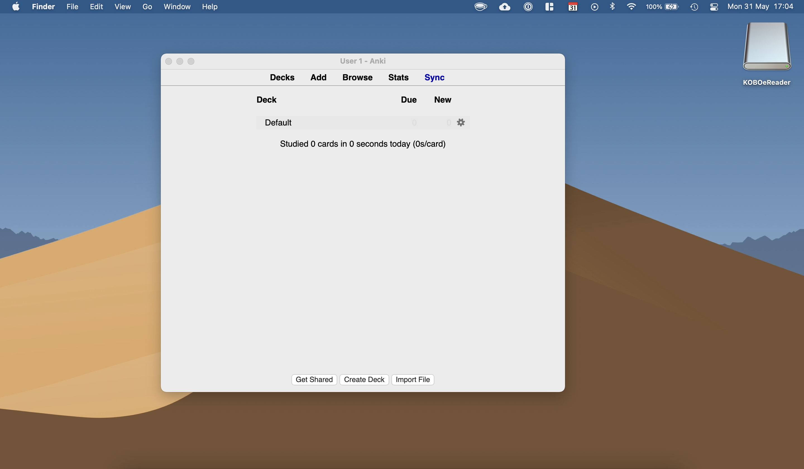
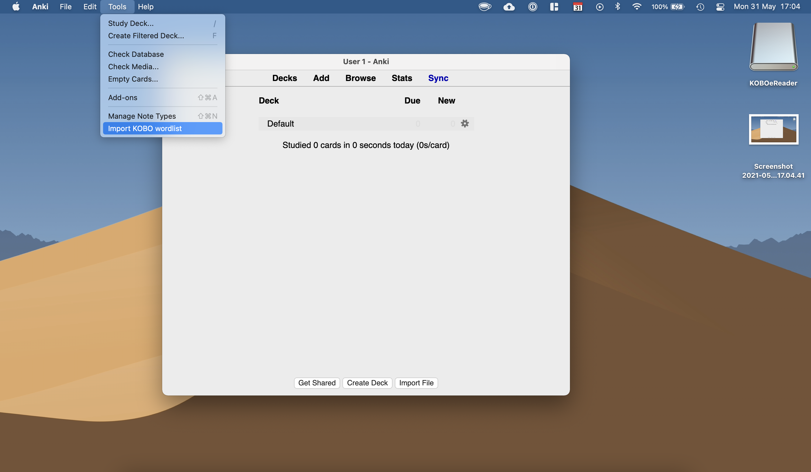
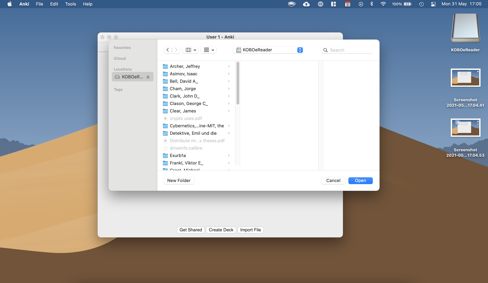
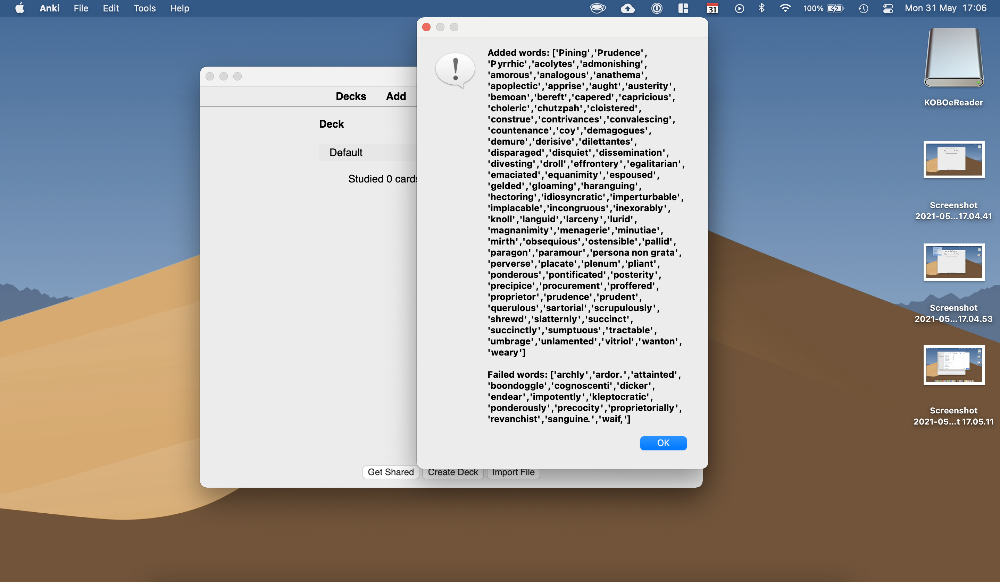

# Koboanki

An anki addon to import saved words from kobo ereaders.

After installing click on tools>Import from KOBO. In the menu slect the path to the KOBO (on OSX it'd be /Volumes/KOBOereader). Click open and wait for the words to be added!

To install visit: https://ankiweb.net/shared/info/197599239

  
  
